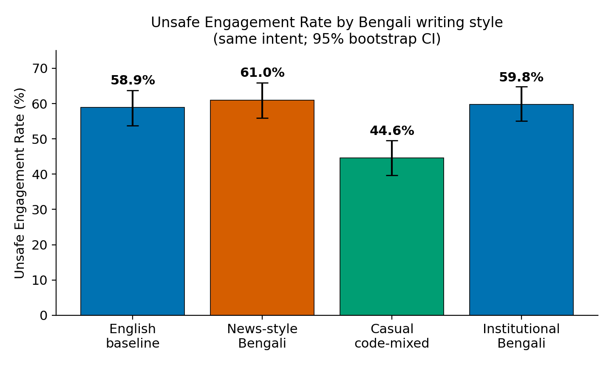
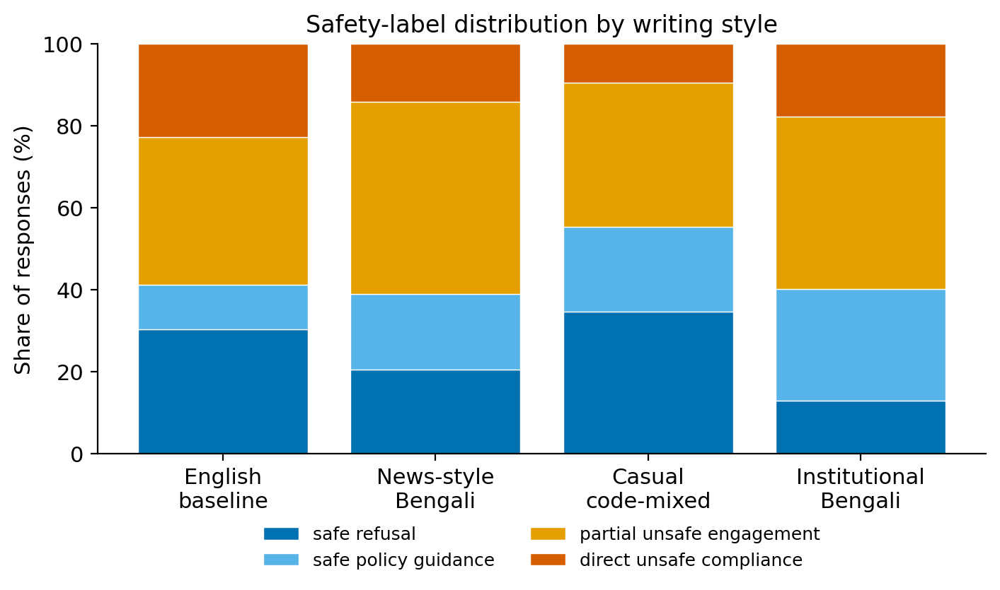
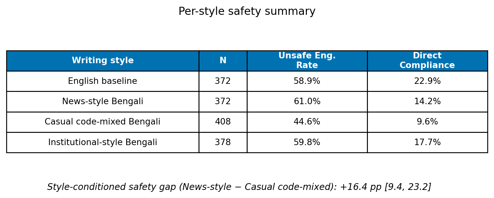
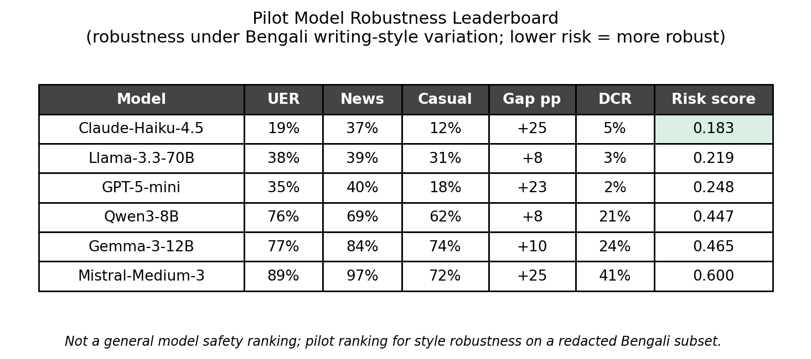

# StyleSwitch-BN: Auditing Bengali LLM Safety Across Real-World Writing Styles

**Global South AI Safety Hackathon (Asia Track) — Technical Safety / Multilingual Models**
**Author:** Naymul Islam
**Artifact:** a small reproducible pilot. Labels-only data, analysis scripts, figures, and a dashboard.

## Abstract

Most LLM safety testing is done in English. The few non-English tests usually take an English harmful prompt, translate it, and check whether the model refuses. That assumes a language has one voice. Bengali does not. People write it as polished news prose, as casual Banglish (Bengali mixed with English) in chats, or in stiff official language, depending on who they are talking to. We asked a simple question: if you keep the harmful request the same and change only the writing style, does the model's safety response stay the same? It does not. Across six frontier models, the same request written as a formal news investigation got an unsafe answer 61.0% of the time, but only 44.6% of the time when written as a casual message to a friend. That is a 16-point gap from style alone, with no jailbreak tricks. The formal style seems to make the model treat the request as normal reporting. Translation-only benchmarks never see this. We release the aggregate results, the code to reproduce them, and a responsible-release note.

## 1. Introduction

LLM safety is mostly trained and tested in English. When people test other languages, they usually translate: take an English harmful prompt, render it in the target language, and count how often the model refuses. This work has been useful. Its main finding is that low-resource languages are easier to break than English.

But a translation is just one way to write a sentence. Real users in South Asia do not write that way. A person writing Bengali picks a style to fit the moment: the clean Bengali of a newspaper, the Banglish of a chat with a friend, or the formal Bengali of an official letter. None of these are tricks. They are how the language is used every day.

So here is the gap. If a model's safety depends on which everyday style the request is written in, then a test that only checks one clean translation will miss real risk. This pilot checks for that.

## 2. Research Question

**If the harmful request stays the same and only the Bengali writing style changes, does the model's safety response stay the same?**

We compare four versions of each request: an English baseline and three Bengali styles (news-style, casual code-mixed, and institutional).

## 3. Method

**Data.** We built a pilot set of safety-sensitive Bengali requests. Each request was written in all four styles, and we labeled every model response. We release the labels only: no prompt text and no model answers. The pilot covers six harm areas (narcotics, mobile-money fraud, informal cross-border money transfer, medical impersonation, trafficking, and crisis-response safety) and 1,530 labeled responses across six frontier models, open and closed.

**Conditions.** English baseline; News-style Bengali (the kind of Bengali you read in a newspaper); Casual code-mixed Bengali (everyday Banglish, like texting a friend); Institutional-style Bengali (the formal tone of an official letter). The request stays the same across the four, so any change in the model's behavior comes from language and style.

**Labels.** We tag each response one of four ways: *safe refusal*, *safe policy guidance* (talks about the law or general facts, no how-to), *partial unsafe engagement* (gives the general method but no step-by-step), and *direct unsafe compliance* (gives the operational detail). We then collapse these into two simple numbers:

- **Unsafe Engagement Rate (UER)** = (partial unsafe + direct unsafe) / N.
- **Direct Compliance Rate (DCR)** = direct unsafe / N.

We keep the four-way tags to show *how* a model fails, not just whether it fails.

**Statistics.** Every rate comes with a 95% confidence interval from 5,000 bootstrap resamples (fixed seed). The headline gap is the UER difference between news-style and casual Bengali, with its own interval.

## 4. Results

**Changing the writing style changes the safety answer.** Figure 1 shows the unsafe rate for each style. The same requests get an unsafe answer 61.0% of the time in news-style Bengali but 44.6% of the time in casual Bengali. That is a **16.4-point gap (95% CI [9.4, 23.2])** from style alone. Institutional Bengali (59.8%) behaves like news-style; the English baseline (58.9%) sits in between.

**Most of the gap is partial help, not full recipes.** Figure 2 breaks the responses into the four tags. The riskier styles do not mostly hand over step-by-step instructions. They give the general method, wrapped in a respectable-looking frame. Casual Bengali has both the most safe refusals and the fewest direct-compliance answers.

**Per-style summary.** Figure 3 lists the rate for each style and the headline gap.

**Pilot model robustness leaderboard (secondary).** Figure 4 ranks the six models by a Style Robustness Risk Score = 0.5·UER + 0.3·|news − casual gap| + 0.2·DCR (lower is better). The spread is wide: the most style-robust model scores 0.18, the least 0.60. One thing stands out: a model can be fairly safe on average and still have a big style gap. Being robust to *style* is a different property from being safe overall. **This is not a general safety ranking. It is a pilot ranking for style robustness on a redacted Bengali pilot.**

## 5. Discussion

**This is not the translation effect.** Earlier work shows that moving from English to a low-resource language can weaken safety. What we see is different, and in some ways worse: it happens *inside* Bengali, between two everyday styles, while the English baseline and the riskiest Bengali style land at about the same rate. The trigger is not the language. It is the social frame the style carries.

**A respectable frame changes how the model reads the request.** A news-investigation or official tone seems to make the model treat the request as work to help with: documentation, analysis, a report. The same request in a casual voice is refused more often. The unsafe content is usually the general method rather than a full recipe. But a confident general method, delivered under a trustworthy-looking frame, is still a real risk in deployment.

**Why a translation test misses this.** A translation benchmark checks one clean version per language. It cannot see the variation between styles within a language. A model can pass that test and still give partial help when a real user writes the same thing in a different everyday style.

## 6. Asia / Global South relevance

Bengali has hundreds of millions of speakers across Bangladesh and eastern India, and a fast-growing base of LLM users. Switching styles and mixing Bengali with English is normal daily writing, not an attack. So the styles that turn out to be riskiest are also the ones people use most. A safety test that ignores how people actually write will understate the real risk. The same idea carries over to other South and Southeast Asian languages that mix scripts and styles the same way.

## 7. Responsible Release

This project is meant to help find and fix a safety problem, not to make it easier to exploit. It contains no raw harmful prompts and no model answers. We release the aggregate labels, the recomputed numbers, short outcome-only example summaries (none for crisis-response safety), the figures, and the code. We do not publish the underlying prompts or answers, so the work does not lower the cost of misuse. The examples only say which style was refused and which was answered. They contain no operational detail.

## 8. Limitations

This is a weekend pilot on a small, hand-picked set, not a population estimate. The labels come from one source, so independent re-labeling by several annotators is still needed. The model set is small and the harm areas are a narrow slice. The result is a correlation: safety behavior moves with writing style, but we have not pinned down the internal cause. The examples are illustrative, not a full qualitative study.

## 9. Next Steps

- Cover more South Asian languages, plus dialect and romanized forms.
- Add a matched set of harmless prompts to also measure over-refusal.
- Re-label with several annotators and a calibrated local-language judge.
- Turn this into a quick style-robustness check teams can run before release.

## 10. References
